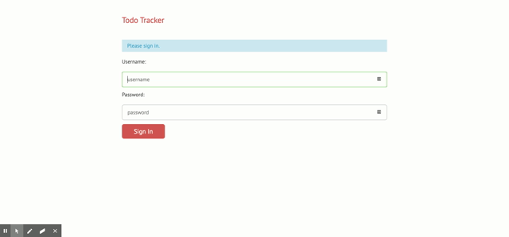
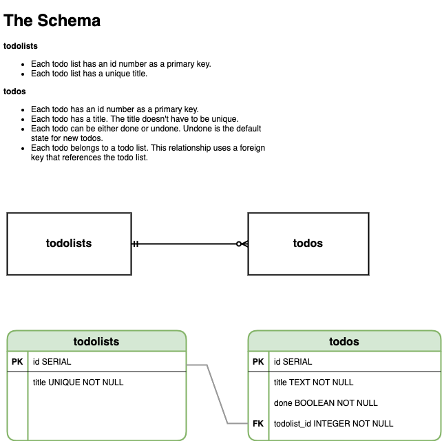

# To-Do App Developed with PostgreSQL database and multiple-user accounts

Todo App is a productivity web-application that allows users to create, update, delete and view lists of todos and individual todo items on those lists. 

This app is developed as a part of the final course in [Launch School](*https://launchschool.com/*) [LS] back-end curriculum JS185. This application serves as a showcase of different aspects of programming that I have learned in LS so far: 

- Programming Foundations with JavaScript
- Object Oriented Programming with JavaScript
- More JavaScript Foundations
- Networking Foundations
- and Database Foundations

> ** You can find my solution to the JavaScript exercises for the courses mentioned above by browsing my GitHub profile: https://github.com/dmytronayda

## Review of the Functionality and Basic Use Cases

Please check a short video on YouTube with me going through the main features of the Todo App by following this URL: 

**Need to create a short review video of the application**

## Testing and Installation

The live demo of the application deployed using Heroku can be reviewed by following URL: https://limitless-plains-71401.herokuapp.com/users/signin

:point_down: **Sign in details:** 

username: "developer" 

password: "letmein"

> ** Please do not use `"` quatation marks for the sign in. They are used only as a delimiters for string start and end.

## Technology Solutions

**The application uses following technologies and Node.js modules: **

- [pug](https://pugjs.org/api/getting-started.html) -- for HTML templating
- [express](https://www.npmjs.com/package/express) -- for managing the networking routing
- [morgan](https://www.npmjs.com/package/morgan) -- for logging and monitoring the app status to the console 
- [flash](https://www.npmjs.com/package/flash) -- for error handling
- [express-session](https://www.npmjs.com/package/express-session) -- for storing the session data (used originally in the JS175 Networking version of the application and for testing)
- [express-validator](https://express-validator.github.io/docs/)  -- sanitizes user inputs and lowers the changes of cross-site scripting and other security risks
- [connect-loki](https://github.com/Requarks/connect-loki#readme) -- used for session store
- [pg-persistence](https://github.com/dmytronayda/todos-app-postgresql-practice/blob/master/lib/pg-persistence.js) -- self-developed module to handle server-side logic: 
  - load Todo lists and individual todos
  - sort Todo lists and individual todos
  - toggle done/undone status of a todo
  - create new Todo lists and individual todos
  - etc.
- [catch-error](https://github.com/dmytronayda/todos-app-postgresql-practice/blob/master/lib/catch-error.js) -- self-developed module to improve the error logging and debugging

**The Application uses PostgreSQL to store the lists of todos and individual todos in a relational database. Below you can see the database design -- both physical and conceptual schemas -- that I've designed using** https://app.diagrams.net/: 

